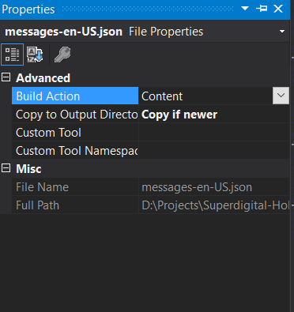

# Superdigital Message Manager
Superdigital Message Manager is a is a library that facilitates the management of multi language messages in the application based on cultureinfo, extracting information from a simple json.

```json
{
  "Language": "en-US",
  "Messages": [
    {
      "Key": "AccountDoesntExists",
      "Code": "001",
      "Property": "Account",
      "Value": "Account doesn't exists"
    },
    {
      "Key": "AccountAmountNotTheSame",
      "Code": "002",
      "Property": "Account",
      "Value": "AccountCurrency is not the same in Initiator and Receiver ({0} + {1})"
    }
  ]
}
```


### Getting started

Superdigital Message Manager is installed from NuGet:

```
Install-Package Superdigital.MessageManager
```
```
dotnet add package Superdigital.MessageManager
```

To configure, simply add the manager on Startup.cs.

```csharp
public void ConfigureServices(IServiceCollection services)
{
    ...

    services.AddMessageManager(c =>
    {
        c.AddFileMessage("Messages/messages-en-US.json");
        c.AddFileMessage("Messages/messages-es-AR.json");
        c.AddFileMessage("Messages/other-messages-en-US.json");

        // Optional
        c.SetDefaultCultureInfo(new CultureInfo("es-AR"));
    });

    ...
}
```

Make sure your json file is configured for directory output




If the application suports multi languages, add the `RequestLocalizationOptions` configuration 

```csharp
public void ConfigureServices(IServiceCollection services)
{
    ...
    services.Configure<RequestLocalizationOptions>(options =>
    {
        options.RequestCultureProviders.Insert(0, new CustomRequestCultureProvider(context =>
        {
            var userLangs = context.Request.Headers["Accept-Language"].ToString();
            var firstLang = userLangs.Split(',').FirstOrDefault();
            var defaultLang = string.IsNullOrEmpty(firstLang) ? "en" : firstLang;

            context.RequestServices.GetRequiredService<IMessageManager>().SetRequestCultureInfo(new System.Globalization.CultureInfo(defaultLang));

            return Task.FromResult(new ProviderCultureResult(defaultLang, defaultLang));
        }));
    });
    ...
}

public void Configure(IApplicationBuilder app, IWebHostEnvironment env)
{
   ...

    app.UseRequestLocalization();

   ...
}
```

To use it, simple inject into your services, example:

```csharp
...
public WeatherForecastController(IMessageManager messageManager)
{
    _messageManager = messageManager;

}

[HttpGet]
[Route("message-001")]
public IActionResult GetMessage001()
{
   var message = _messageManager.GetMessage("AccountDoesntExists");


    return Ok(message);
}
...
```

To format messages, call the method, example:

```csharp
...


[HttpGet]
[Route("message-001")]
public IActionResult GetMessage001()
{
   var message = manager.GetMessage("AccountCurrencyDifferentCompensationCurrency").FormatValue("BRL", "USD");


    return Ok(message);
}
...
```


Enjoy!

_Superdigital &copy; 2020._